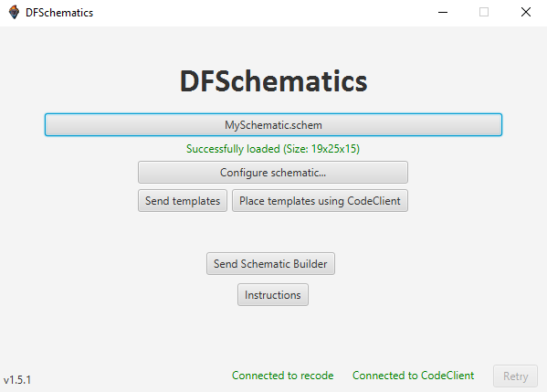

# DFSchematics v1.0.0
Tool to import schematic files into DiamondFire.

You can use this application to convert schematic files to 
DiamondFire data templates, which can then be imported into
a plot using a builder function.  
This is useful for e.g. importing maps and games with rotating
(destructible) maps. This is the successor to Schem2DF.

_I do not take responsibility for the ownership/copyright of any builds imported through this program._

## Install

To install the application, go to the [releases page](https://github.com/RyanLandDev/DFSchematics/releases) and download the executable file from the latest version.

## How to use

1. Launch Minecraft with either [recode](https://github.com/homchom/recode) or [CodeClient](https://github.com/DFOnline/CodeClient) installed.
2. Navigate to a plot in dev mode.
3. Open the program, click _'Pick file...'_ and choose a Sponge schematic file (`.schem`)*.
4. Send the generated schematic data template(s) to Minecraft and place them in order.
5. Send the builder template to Minecraft and place it.
6. Call the builder function and configure the chest parameters.

_*At the moment, only Sponge schematics are compatible, although additional formats may be supported in the future.
If you have a different format, please convert it to a Sponge schematic beforehand._

## Support

If you need help using the program, you can contact me on Discord at `ryandev.`.

## Suggestions/Bugs

Do you have a suggestion or have you found a bug? Please [open an issue](https://github.com/RyanLandDev/DFSchematics/issues/new)
or contact me on Discord at `ryandev.`.

## Dependencies
- Java 17
- JavaFX 17
- [Sponge Schematic Format](https://github.com/SpongePowered/Schematic-Specification)
- [schematic4j](https://github.com/SandroHc/schematic4j)
- [Java-WebSocket](https://github.com/TooTallNate/Java-WebSocket)
- [recode](https://github.com/homchom/recode) Item API
- [CodeClient](https://github.com/DFOnline/CodeClient) API